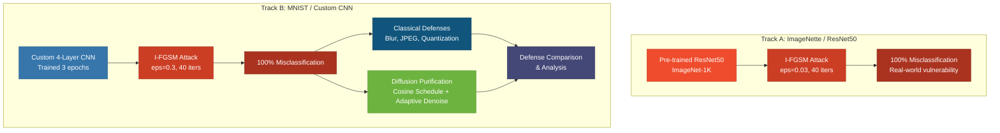
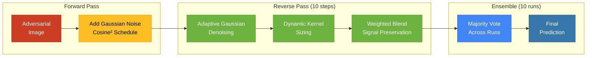

<div align="center">

# **Adversarial Robustness**
## I-FGSM Attacks & Diffusion-Based Purification

*Investigating the vulnerability of deep neural networks to gradient-based adversarial perturbations and developing a lightweight, model-free defense using stochastic purification.*

### **Technology Stack**

[](https://python.org)
[](https://pytorch.org)
[](https://pytorch.org/vision)
[](https://numpy.org)

[](https://matplotlib.org)
[](https://seaborn.pydata.org)
[](https://developer.nvidia.com/cuda-toolkit)
[](https://colab.research.google.com)

</div>

---

## Overview

This research project evaluates the security of deep neural networks against **Iterative Fast Gradient Sign Method (I-FGSM)** adversarial attacks and benchmarks multiple defense strategies — from classical input transformations to a novel **diffusion-inspired stochastic purification pipeline**.

The core contribution is a **lightweight, model-free purification defense** that adapts the DDPM cosine-squared noise schedule (Nichol & Dhariwal, 2021) with an analytically-defined adaptive Gaussian denoiser, requiring **no additional neural network** for the defense — only controlled noise injection and structured denoising.

---

## The Problem

Deep neural networks are vulnerable to **adversarial examples** — inputs with imperceptible perturbations that cause confident misclassification. I-FGSM iteratively applies small gradient-based noise, staying within a defined epsilon-ball while maximizing the loss function.

### **Attack Demonstration**

| Image | Original Prediction | Attacked Prediction | Confidence |
|:------|:-------------------|:-------------------|:-----------|
| Tench | Tench (99.5%) | Reel (100.0%) | Complete flip |
| English Springer | English Springer (81.8%) | Shih Tzu (100.0%) | Complete flip |
| Chainsaw | Chainsaw (61.1%) | Lorikeet (100.0%) | Complete flip |
| Church | Church (32.6%) | Fountain (100.0%) | Complete flip |

> **100% attack success rate** across both ResNet50 (ImageNet) and custom CNN (MNIST), with adversarial confidence reaching 100% on most samples.

---

## Research Methodology

The research follows a two-track **attack-then-defend** paradigm:



---

## Attack Implementation

### **I-FGSM (Iterative Fast Gradient Sign Method)**

Unlike single-step FGSM, I-FGSM applies perturbations iteratively to ensure the adversarial example remains within a defined epsilon-ball while maximizing the loss function across multiple steps.

**ImageNette Configuration:**
- Epsilon: `0.03` (normalized pixel space)
- Step size (alpha): `0.005`
- Iterations: `40`
- Architectures: ResNet50 (pre-trained, ImageNet-1K)

**MNIST Configuration:**
- Epsilon: `0.3` ([0,1] grayscale range)
- Step size (alpha): `0.01`
- Iterations: `40`
- Architecture: Custom CNN (Conv2d×2 → MaxPool → Dropout → FC×2)

---

## Defense Strategies

### **Classical Defenses**

| Defense | Method | Result |
|---------|--------|--------|
| Gaussian Blur | kernel=5, sigma=1.5 | 2/5 recovered |
| JPEG Compression | quality=15 (aggressive) | 0/5 recovered |
| 3-bit Quantization | `round(x * 7) / 7` | 0/5 recovered |

### **Diffusion-Based Purification (Novel Approach)**

The defense architecture is inspired by the forward and reverse processes of Diffusion Models, operating on the theory that adversarial perturbations exist as structured, high-frequency signals that can be disrupted through controlled stochastic noise injection.



**Pipeline Details:**

1. **Forward Noise Injection** — Gaussian noise applied according to the DDPM cosine-squared schedule (Nichol & Dhariwal, 2021) to neutralize adversarial gradients
2. **Adaptive Denoising** — Dynamic kernel size (`max(3, int(noise_level * 30) | 1)`) and sigma (`noise_level * 10`) scale with the noise-to-signal ratio at each timestep
3. **Signal Preservation** — Smoothing strength capped at 0.9, ensuring at least 10% of original structure always survives
4. **Ensemble Majority Vote** — 10 independent purification runs with fresh random noise, final prediction via `torch.bincount` majority voting

---

## Results

### **Defense Efficacy Comparison**

| Defense | Success | Partial | Failed | Attack Disruption |
|---------|:-------:|:-------:|:------:|:-----------------:|
| No Defense | 0/5 | 0/5 | 5/5 | 0% |
| Gaussian Blur | 2/5 | 0/5 | 3/5 | 40% |
| JPEG Compression (Q=15) | 0/5 | 0/5 | 5/5 | 0% |
| 3-bit Quantization | 0/5 | 0/5 | 5/5 | 0% |
| **Diffusion Purification** | **1/5** | **3/5** | **1/5** | **80%** |

> **Key Finding:** The diffusion purification pipeline disrupts the adversarial pattern in **4 out of 5 cases** (80% attack disruption), significantly outperforming all classical defenses. While full accuracy recovery remains challenging, the approach demonstrates that non-targeted noise injection followed by structural denoising is far more effective than direct filtering.

### **Key Outcomes**

- **Robustness Identification** — Quantified the epsilon thresholds where traditional data-transformation defenses fail against iterative attacks
- **Stochastic Recovery** — Demonstrated that non-targeted noise injection followed by structural denoising is significantly more effective than direct filtering
- **Operational Efficiency** — Utilized bitwise operations for dynamic kernel sizing to minimize computational overhead, ensuring scalability for real-time inference

---

## Visualizations Produced

The notebook generates several publication-quality figures:

| Figure | Description |
|--------|-------------|
| Attack Grid | 5×3 grid: Original \| Adversarial \| Perturbation (×10 magnified, RdBu colormap) |
| Defense Comparison | Per-image comparison across all defense strategies with prediction labels |
| Defense Heatmap | Seaborn heatmap showing Success/Partial/Failed across defenses (RdYlGn colormap) |
| Purification Triptych | Original vs. Attacked vs. Purified with majority-vote confidence |
| Dataset Samples | 2×5 grid of MNIST digit class representatives |

---

## Quick Start

### **Run in Google Colab** (Recommended)
The notebook is designed for Google Colab with GPU acceleration:

1. Open `AdversarialAttacksResearchFinal.ipynb` in Google Colab
2. Set runtime to **GPU** (Runtime → Change runtime type → T4 GPU)
3. Run all cells sequentially

### **Run Locally**

```bash
# Clone the repository
git clone https://github.com/Brycekoh/adversarial_examples.git
cd adversarial_examples

# Install dependencies
pip install torch torchvision matplotlib seaborn numpy pillow

# Launch Jupyter
jupyter notebook AdversarialAttacksResearchFinal.ipynb
```

### **Dependencies**
- `torch` & `torchvision` — deep learning framework and pretrained models
- `matplotlib` & `seaborn` — visualization
- `numpy` — array operations
- `Pillow (PIL)` — JPEG compression defense
- CUDA-capable GPU recommended for iterative denoising passes

---

## Project Structure

```
adversarial_examples/
├── AdversarialAttacksResearchFinal.ipynb   # Complete research notebook
├── README.md                               # This file
└── Generated outputs:
    ├── defense_heatmap.png                 # Defense comparison heatmap
    ├── attack_grid.png                     # I-FGSM attack visualization
    └── figure1_dataset_samples.png         # MNIST dataset samples
```

---

## References

- Goodfellow, I. J., Shlens, J., & Szegedy, C. (2015). *Explaining and Harnessing Adversarial Examples.* ICLR.
- Kurakin, A., Goodfellow, I. J., & Bengio, S. (2017). *Adversarial Examples in the Physical World.* ICLR Workshop.
- Nichol, A. & Dhariwal, P. (2021). *Improved Denoising Diffusion Probabilistic Models.* ICML. arXiv:2102.09672
- Nie, W., et al. (2022). *Diffusion Models for Adversarial Purification.* ICML.

---

## License

MIT License — See [LICENSE](LICENSE) for details.
